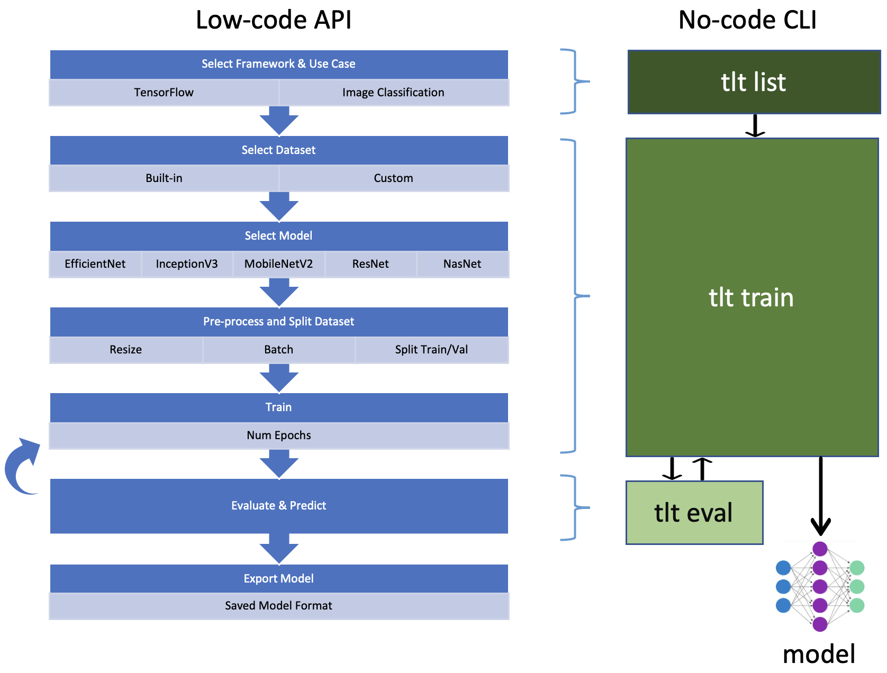

Intel® Transfer Learning Tool
=============================

Goals
-----

* To make transfer learning workflows easier for data scientists for a variety of AI use cases, frameworks, and public
  pretrained models
* To incorporate all available Intel optimizations and best practices for XPU

Features
--------

* Low-code API and no-code CLI for:
   * TensorFlow 2.10.0 or later
      * Image Classification with 19 models from TFHub
      * Text Classification with 26 models from TFHub
   * PyTorch 1.13.1 or later
      * Image Classification with 60 models from Torchvision
      * Text Classification with 4 models from Hugging Face
      * Image Anomaly Detection with 5 models from Torchvision

* Jupyter notebooks:

.. csv-table:: Transfer Learning Tool Tutorial Notebooks
   :header: "Notebook", "Use Case", "Framework"
   :widths: 60, 20, 20

   :doc:`Image Classification with TF using the Intel® Transfer Learning Tool API <notebooks/TLT_TF_Image_Classification_Transfer_Learning>`, Image Classification, TensorFlow & TLT
   :doc:`Image Classification with PyTorch using the Intel® Transfer Learning Tool API <notebooks/TLT_PyTorch_Image_Classification_Transfer_Learning>`, Image Classification, PyTorch & TLT
   :doc:`Text Classification with TF using the Intel® Transfer Learning Tool API <notebooks/TLT_TF_Text_Classification_Transfer_Learning>`, Text Classification, TensorFlow & TLT
   :doc:`Text Classification with PyTorch using the Intel® Transfer Learning Tool API <notebooks/TLT_PyTorch_Text_Classification_Transfer_Learning>`, Text Classification, PyTorch & TLT

.. csv-table:: Native Framework Transfer Learning Notebooks
   :header: "Notebook", "Use Case", "Framework"
   :widths: 60, 20, 20

   Image Classification with TF Hub, Image Classification, TensorFlow
   Image Classification with PyTorch & Torchvision, Image Classification, PyTorch
   Object Detection with PyTorch & Torchvision, Object Detection, PyTorch
   BERT SQuAD fine tuning with TF Hub, Question Answering, TensorFlow
   BERT Binary Text Classification with TF Hub, Text Classification, TensorFlow
   BERT Multiclass Text Classification with TF Hub, Text Classification, TensorFlow
   Text Classifier fine tuning with PyTorch & Hugging Face, Text Classification, PyTorch
   Video Classification with PyTorch & Torchvision, Video Classification, PyTorch

.. csv-table:: Transfer Learning Tool End-to-End Pipelines
   :header: "Notebook", "Use Case", "Framework"
   :widths: 60, 20, 20

   :doc:`Medical Imaging using TensorFlow and the Intel® Transfer Learning Tool API<notebooks/Medical_Imaging_Classification>`, Image Classification, TensorFlow & TLT
   :doc:`Remote Sensing using TensorFlow and the Intel® Transfer Learning Tool API<notebooks/Remote_Sensing_Image_Scene_Classification>`, Image Classification, TensorFlow & TLT
   Multi-modal Cancer Detection, Image & Text Classification, TensorFlow & PyTorch & TLT
   Document-level Sentiment Analysis, Text Classification, PyTorch & TLT
   Anomaly Detection using PyTorch and the Intel® Transfer Learning Tool API, Image Anomaly Detection, PyTorch & TLT

Models
------

.. csv-table::
   :header: TensorFlow,PyTorch
   :widths: 50, 50

   bert_en_uncased_L-12_H-768_A-12,alexnet
   bert_en_wwm_uncased_L-24_H-1024_A-16,convnext_tiny
   efficientnet_b0,convnext_small
   efficientnet_b1,convnext_base
   efficientnet_b2,convnext_large
   efficientnet_b3,densenet121
   efficientnet_b4,densenet161
   efficientnet_b5,densenet169
   efficientnet_b6,densenet201
   efficientnet_b7,efficientnet_b0
   efficientnetv2-b0,efficientnet_b1
   efficientnetv2-b1,efficientnet_b2
   efficientnetv2-b2,efficientnet_b3
   efficientnetv2-b3,efficientnet_b4
   efficientnetv2-s,efficientnet_b5
   inception_v3,efficientnet_b6
   mobilenet_v2_100_224,efficientnet_b7
   nasnet_large,googlenet
   resnet_v1_50,mnasnet0_5
   resnet_v2_101,mnasnet1_0
   resnet_v2_50,mobilenet_v2
   small_bert/bert_en_uncased_L-10_H-128_A-2,mobilenet_v3_small
   small_bert/bert_en_uncased_L-10_H-256_A-4,mobilenet_v3_large
   small_bert/bert_en_uncased_L-10_H-512_A-8,resnet18
   small_bert/bert_en_uncased_L-10_H-768_A-12,resnet34
   small_bert/bert_en_uncased_L-12_H-128_A-2,resnet50
   small_bert/bert_en_uncased_L-12_H-256_A-4,resnet101
   small_bert/bert_en_uncased_L-12_H-512_A-8,resnet152
   small_bert/bert_en_uncased_L-12_H-768_A-12,resnext50_32x4d
   small_bert/bert_en_uncased_L-2_H-128_A-2,resnext101_32x8d
   small_bert/bert_en_uncased_L-2_H-256_A-4,regnet_x_400mf
   small_bert/bert_en_uncased_L-2_H-512_A-8,regnet_x_800mf
   small_bert/bert_en_uncased_L-2_H-768_A-12,regnet_x_1_6gf
   small_bert/bert_en_uncased_L-4_H-128_A-2,regnet_x_3_2gf
   small_bert/bert_en_uncased_L-4_H-256_A-4,regnet_x_8gf
   small_bert/bert_en_uncased_L-4_H-512_A-8,regnet_x_16gf
   small_bert/bert_en_uncased_L-4_H-768_A-12,regnet_x_32gf
   small_bert/bert_en_uncased_L-6_H-128_A-2,regnet_y_400mf
   small_bert/bert_en_uncased_L-6_H-256_A-4,regnet_y_800mf
   small_bert/bert_en_uncased_L-6_H-512_A-8,regnet_y_1_6gf
   small_bert/bert_en_uncased_L-6_H-768_A-12,regnet_y_3_2gf
   small_bert/bert_en_uncased_L-8_H-128_A-2,regnet_y_8gf
   small_bert/bert_en_uncased_L-8_H-256_A-4,regnet_y_16gf
   small_bert/bert_en_uncased_L-8_H-512_A-8,regnet_y_32gf
   small_bert/bert_en_uncased_L-8_H-768_A-12,shufflenet_v2_x0_5
   ,shufflenet_v2_x1_0
   ,vgg11
   ,vgg11_bn
   ,vgg13
   ,vgg13_bn
   ,vgg16
   ,vgg16_bn
   ,vgg19
   ,vgg19_bn
   ,vit_b_16
   ,vit_b_32
   ,vit_l_16
   ,vit_l_32
   ,wide_resnet50_2
   ,wide_resnet101_2
   ,bert-base-cased
   ,bert-large-uncased
   ,distilbert-base-uncased
   ,clinical-bert

.. toctree::
   :maxdepth: 1
   :caption: Contents

   quickstart
   cli
   api
   notebooks

Indices and tables
==================

* :ref:`genindex`
* :ref:`modindex`
* :ref:`search`

