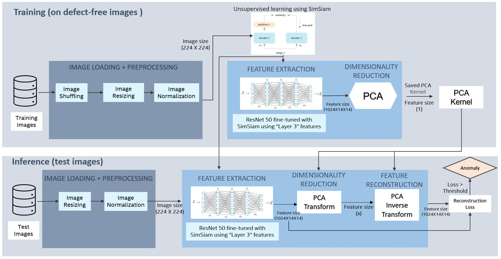
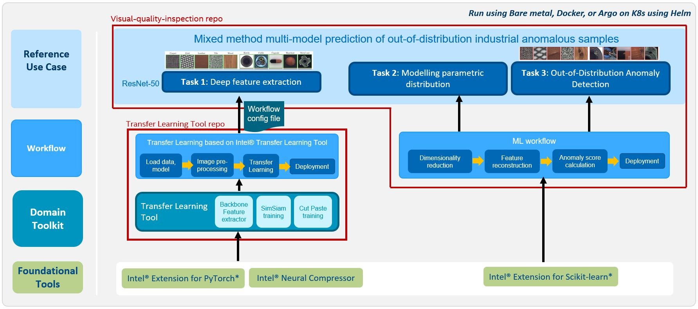
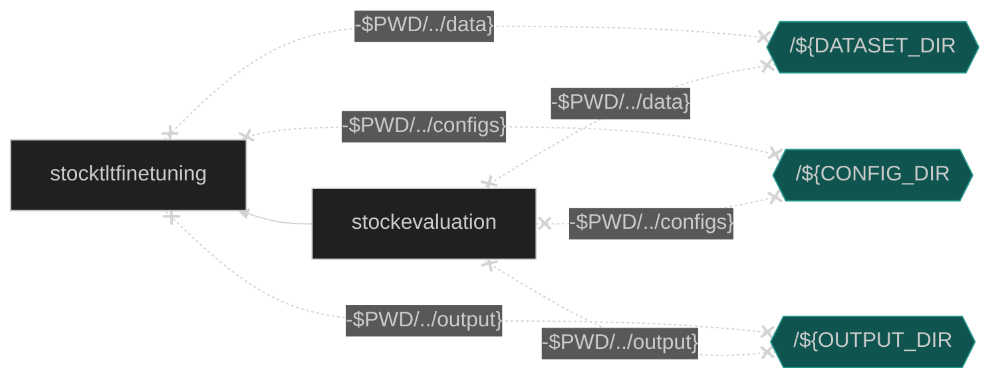

# Fine-tuning for Visual Quality Inspection workflow
This workflow is a fine-tuning module under the [Visual Quality Inspection reference kit](https://github.com/intel/visual-quality-inspection/).The goal of the anomaly detection reference use case is to provide AI-powered visual quality inspection on the high resolution input images by identifing rare, abnormal events such as defects in a part being manufactured on an industrial production line. Use this reference solution as-is on your dataset, curate it to your needs by fine-tuning the models and changing configurations to get improved performance, modify it to meet your productivity and performance goals by making use of the modular architecture and realize superior performance using the Intel optimized software packages and libraries for Intel hardware that are built into the solution. 

## **Table of Contents**
- [Technical Overview](#technical-overview)
    - [DataSet](#DataSet)
- [Validated Hardware Details](#validated-hardware-details)
- [Software Requirements](#software-requirements)
- [How it Works?](#how-it-works)
- [Get Started](#get-started)
    - [Download the Transfer Learning Tool](#Download-the-Transfer-Learning-Tool)
- [Ways to run this reference use case](#Ways-to-run-this-reference-use-case)
    - [Run Using Docker](#run-using-docker)
    - [Run Using Bare Metal](#run-using-bare-metal) 
- [Learn More](#learn-more)
- [Support](#support)

## Technical Overview
This repository provides a layer within the higher level Visual Quality Inspection reference kit and supports the following using [Intel® Transfer Learning Tool](https://github.com/IntelAI/transfer-learning):
- Fine-tuning and inference on custom dataset
- Implementation for different feature extractors based on:
  - Pre-trained model (without fine-tuning)
  - Fine-tuned model based on Simsiam self-supervised technique
  - Fine-tuned model based on CutPaste self-supervised technique

We present an unsupervised, mixed method end-to-end fine-tuning & inference reference solution for anomaly detection where a model of normality is learned from defect-free data in an unsupervised manner, and deviations from the models are flagged as anomalies. This reference use case is accelerated by Intel optimized software and is built upon easy-to-use Intel Transfer Learning Tool APIs.

### DataSet
[MVTec AD](https://www.mvtec.com/company/research/datasets/mvtec-ad) is a dataset for benchmarking anomaly detection methods focused on visual quality inspection in the industrial domain. It contains over 5000 high-resolution images divided into ten unique objects and five unique texture categories. Each category comprises a set of defect-free training images and a test set of images with various kinds of defects as well as defect-free images. There are 73 different types of anomalies in the form of defects or structural deviations present in these objects and textures.

More information can be found in the paper [MVTec AD – A Comprehensive Real-World Dataset for Unsupervised Anomaly Detection](https://www.mvtec.com/fileadmin/Redaktion/mvtec.com/company/research/datasets/mvtec_ad.pdf)


<br>
*Table 1:  Statistical overview of the MVTec AD dataset. For each category, the number of training and test images is given together with additional information about the defects present in the respective test images. [Source](https://www.mvtec.com/fileadmin/Redaktion/mvtec.com/company/research/datasets/mvtec_ad.pdf)*

## Validated Hardware Details
There are workflow-specific hardware and software setup requirements depending on how the workflow is run. Bare metal development system and Docker image running locally have the same system requirements. 

| Recommended Hardware         | Precision  |
| ---------------------------- | ---------- |
| Intel® 4th Gen Xeon® Scalable Performance processors| float32, bfloat16 |
| Intel® 1st, 2nd, 3rd Gen Xeon® Scalable Performance processors| float32 |


## Software Requirements 
Linux OS (Ubuntu 20.04) is used in this reference solution. Make sure the following dependencies are installed.

1. `sudo apt update`
1. `sudo apt-get install -y libgl1 libglib2.0-0`
1. pip/conda OR python3.9-venv
1. git

## How It Works?

The [reference use case](https://github.com/intel/visual-quality-inspection/) uses a deep learning based approach, named deep-feature modeling (DFM) and falls within the broader area of out-of-distribution (OOD) detection i.e. when a model sees an input that differs from its training data, it is marked as an anomaly. Learn more about the approach [here.](https://arxiv.org/pdf/1909.11786.pdf) 

The use case can work with 3 different options for modeling of the vision subtask, implementation for all of which are part of this repository:
* **Pre-trained backbone:** uses a deep network (ResNet-50v1.5 in this case) that has been pretrained on large visual datasets such as ImageNet
* **SimSiam self-supervised learning:** is a contrastive learning method based on Siamese networks. It learns meaningful representation of dataset without using any labels. SimSiam requires a dataloader such that it can produce two different augmented images from one underlying image. The end goal is to train the network to produce same features for both images. It takes a ResNet model as the backbone and fine-tunes the model on the augmented dataset to get closer feature embeddings for the use case. Read more [here.](https://arxiv.org/pdf/2011.10566.pdf)
* **Cut-Paste self-supervised learning:** is a contrastive learning method similar to SimSiam but differs in the augmentations used during training. It take a ResNet model as backbone and fine-tunes the model after applying a data augmentation strategy that cuts an image patch and pastes at a random location of a large image. This allows us to construct a high performance model for defect detection without presence of anomalous data. Read more [here.](https://arxiv.org/pdf/2104.04015.pdf)


*Figure 1: Visual quality inspection pipeline. Above diagram is an example when using SimSiam self-supervised training.*

Training stage only uses defect-free data. Images are loaded using a dataloader and shuffling, resizing & normalization processing is applied. Then one of the above stated transfer learning technique is used to fine-tune a model and extract discriminative features from an intermediate layer. A PCA kernel is trained over these features to reduce the dimension of the feature space while retaining 99% variance. This pre-processing of the intermediate features of a DNN is needed to prevent matrix singularities and rank deficiencies from arising.

During inference, the feature from a test image is generated through the same network as before. We then run a PCA transform using the trained PCA kernel and apply inverse transform to recreate original features and generate a feature-reconstruction error score, which is the norm of the difference between the original feature vector and the pre-image of its corresponding reduced embedding. Any image with an anomaly will have a high error in reconstructing original features due to features being out of distribution from the defect-free training set and will be marked as anomaly. The effectiveness of these scores in distinguishing the good images from the anomalous images is assessed by plotting the ROC curve, which is a plot of the true positive rate (TPR) of the classifier against the false positive rate (FPR) as the classification score-threshold is varied. The AUROC metric summarizes this curve between 0 to 1, with 1 indicating perfect classification.


**Architecture:**

The components shown under the 'Transfer Learning Tool repo' in the figure above is what is included in this folder


### Highlights of Visual Quality Inspection Reference Use Case
- The use case is presented in a modular architecture. To improve productivity and reduce time-to-solution, transfer learning methods are made available through an independent workflow that seamlessly uses Intel Transfer Learning Tool APIs underneath and a config file allows the user to change parameters and settings without having to deep-dive and modify the code.
- There is flexibility to select any pre-trained model and any intermediate layer for feature extraction.
- The use case is enabled with Intel optimized foundational tools.


## Get Started
### Download the Transfer Learning Tool
It contains the workflow code:
```
export $WORKSPACE=/<workdir/path>
cd $WORKSPACE
git clone https://github.com/IntelAI/transfer-learning.git
cd transfer-learning/workflows/vision_anomaly_detection
```

## Ways to run this reference use case
This reference kit offers three options for running the fine-tuning and inference processes:

- [Docker](#run-using-docker)
- [Bare Metal](#run-using-bare-metal)

Details about each of these methods can be found below. Keep in mind that each method must be executed in a separate environment from each other. If you run first Docker Compose and then bare metal, this will cause issues.

## Run Using Docker
Follow these instructions to set up and run our provided Docker image. For running on bare metal, see the [bare metal](#run-using-bare-metal) instructions.

### 1. Set Up Docker Engine and Docker Compose
You'll need to install Docker Engine on your development system. Note that while **Docker Engine** is free to use, **Docker Desktop** may require you to purchase a license. See the [Docker Engine Server installation instructions](https://docs.docker.com/engine/install/#server) for details.


To build and run this workload inside a Docker Container, ensure you have Docker Compose installed on your machine. If you don't have this tool installed, consult the official [Docker Compose installation documentation](https://docs.docker.com/compose/install/linux/#install-the-plugin-manually).


```bash
DOCKER_CONFIG=${DOCKER_CONFIG:-$HOME/.docker}
mkdir -p $DOCKER_CONFIG/cli-plugins
curl -SL https://github.com/docker/compose/releases/download/v2.7.0/docker-compose-linux-x86_64 -o $DOCKER_CONFIG/cli-plugins/docker-compose
chmod +x $DOCKER_CONFIG/cli-plugins/docker-compose
docker compose version
```

### 2. Install Workflow Packages and Intel Transfer Learning Toolkit
Ensure you have completed steps in the [Get Started Section](#get-started).

### 3. Set Up Docker Image
Build or Pull the provided docker image.

```bash
git clone https://github.com/IntelAI/models -b r2.11 intel-models
cd docker
docker compose build
cd ..
```
OR
```bash
docker pull intel/ai-workflows:beta-tlt-anomaly-detection
```

### 4. Preprocess Dataset with Docker Compose
Prepare dataset for Anomaly Detection workflows and accept the legal agreement to use the Intel Dataset Downloader.

```bash
mkdir data && chmod 777 data
cd docker
docker compose run -e USER_CONSENT=y preprocess 
```

### 5. Run Pipeline with Docker Compose

The Vision Finetuning container must complete successfully before the Evaluation container can begin. The Evaluation container uses the model and checkpoint files created by the vision fine-tuning container stored in the `${OUTPUT_DIR}` directory to complete the evaluation tasks.




#### View Logs
Follow logs for the workflow using the commands below:

```bash
docker compose logs stock-tlt-fine-tuning -f
```

#### Run Docker Image in an Interactive Environment

If your environment requires a proxy to access the internet, export your
development system's proxy settings to the docker environment:
```bash
export DOCKER_RUN_ENVS="-e ftp_proxy=${ftp_proxy} \
  -e FTP_PROXY=${FTP_PROXY} -e http_proxy=${http_proxy} \
  -e HTTP_PROXY=${HTTP_PROXY} -e https_proxy=${https_proxy} \
  -e HTTPS_PROXY=${HTTPS_PROXY} -e no_proxy=${no_proxy} \
  -e NO_PROXY=${NO_PROXY} -e socks_proxy=${socks_proxy} \
  -e SOCKS_PROXY=${SOCKS_PROXY}"
```

Build Container:

```bash
docker build \
    --build-arg http_proxy=${http_proxy} \
    --build-arg https_proxy=${https_proxy} \
    ../../ \
     -f ./Dockerfile \
     -t intel/ai-workflows:beta-tlt-anomaly-detection
```

Run the workflow with the ``docker run`` command, as shown:

```bash
export CONFIG_DIR=$PWD/../configs
export DATASET_DIR=$PWD/../data
export OUTPUT_DIR=$PWD/../output
docker run -a stdout ${DOCKER_RUN_ENVS} \
           -e PYTHONPATH=/workspace/transfer-learning \
           -v /$PWD/../transfer-learning:/workspace/transfer-learning \
           -v /${CONFIG_DIR}:/workspace/configs \
           -v /${DATASET_DIR}:/workspace/data \
           -v /${OUTPUT_DIR}:/workspace/output \
           --privileged --init -it --rm --pull always --shm-size=8GB \
	   intel/ai-workflows:beta-tlt-anomaly-detection
```

Run the command below for fine-tuning:
```
python ./src/vision_anomaly_wrapper.py --config_file ./config/config.yaml
```

### 7. Clean Up Docker Containers
Stop containers created by docker compose and remove them.

```bash
docker compose down
```

## Run Using Bare Metal

### 1. Create environment and install software packages

Using conda:
```
conda create -n anomaly_det_finetune python=3.9
conda activate anomaly_det_finetune
pip install -r requirements.txt
```

Using virtualenv:
```
python3 -m venv anomaly_det_finetune
source anomaly_det_finetune/bin/activate
pip install -r requirements.txt
```

### 2. Download the dataset

Download the mvtec dataset using Intel Model Zoo dataset download API
```
git clone https://github.com/IntelAI/models.git $WORKSPACE/models
cd $WORKSPACE/models/datasets/dataset_api/
```

Install dependencies and download the dataset
```
pip install -r requirements.txt
./setup.sh
python dataset.py -n mvtec-ad --download -d $WORKSPACE
```

Extract the tar file
```
cd $WORKSPACE
mkdir mvtec_dataset
tar -xf mvtec_anomaly_detection.tar.xz --directory mvtec_dataset
```

### 3. Select parameters and configurations

Select the parameters and configurations in the config/config.yaml file.
NOTE: 
When using SimSiam self supervised training, download the Sim-Siam weights based on ResNet50 model and place under simsiam directory:
```
mkdir simsiam
wget --directory-prefix=/simsiam/ https://dl.fbaipublicfiles.com/simsiam/models/100ep-256bs/pretrain/checkpoint_0099.pth.tar -o ./simsiam/checkpoint_0099.pth.tar
```

### 4. Running the end-to-end use case 
```
cd $WORKSPACE/transfer-learning/workflows/vision_anomaly_detection/
python src/vision_anomaly_wrapper.py --config_file config/config.yaml
```

## Learn More
For more information or to read about other relevant workflow examples, see these guides and software resources:
- [Intel® Transfer Learning Tool](https://github.com/IntelAI/transfer-learning)
- [Anomaly Detection fine-tuning workflow using SimSiam and CutPaste techniques](https://github.com/IntelAI/transfer-learning/tree/main/workflows/vision_anomaly_detection)
- [Intel® AI Analytics Toolkit (AI Kit)](https://www.intel.com/content/www/us/en/developer/tools/oneapi/ai-analytics-toolkit.html)
- [Intel® Extension for PyTorch](https://intel.github.io/intel-extension-for-pytorch/)
- [Intel® Extension for Scikit-learn](https://www.intel.com/content/www/us/en/developer/tools/oneapi/scikit-learn.html#gs.x609e4)
- [Intel® Neural Compressor](https://github.com/intel/neural-compressor)

## Support
If you have any questions with this workflow, want help with troubleshooting, want to report a bug or submit enhancement requests, please submit a GitHub issue.

---

\*Other names and brands may be claimed as the property of others.
[Trademarks](https://www.intel.com/content/www/us/en/legal/trademarks.html).


